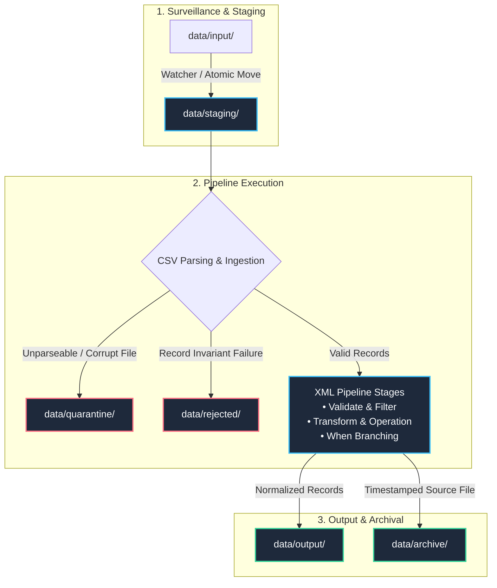
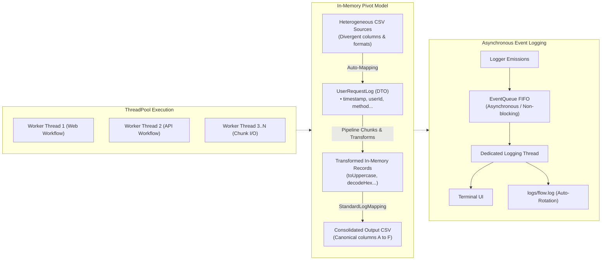

# Flow

## *High-velocity declarative data ingestion and normalization engine*


[](https://discord.gg/mxZvun4)
[](https://github.com/MorganCaron/Flow/blob/master/LICENSE)


### Project Health


---

**Flow** is a modern C++26 high-velocity declarative data transformation and normalization engine, architected as an **extensible production starter template**. Built upon [`CppUtils`](https://github.com/MorganCaron/CppUtils), it ingests disparate data sources (CSV, logs, events), automatically maps them onto strongly typed in-memory C++ structures, executes composable pipelines declared entirely in XML without recompilation, and exports consolidated formats with transactional safety and zero superfluous copying.

> [!NOTE]
> **Starter Template & Reference Implementation**: Flow is not a rigid single-purpose tool, but a modular starter template. The bundled Web and API log ingestion pipeline ([`UserRequestLog.mpp`](modules/UserRequestLog.mpp), [`flow_web.xml`](data/flows/flow_web.xml), [`flow_api.xml`](data/flows/flow_api.xml)) is a complete, production-grade reference implementation. Flow is engineered to be used as a template repository, customized, and adapted to your own data schemas, file formats, and business transformations in minutes.

## Key Architecture & Features

Flow is architected around five core design pillars to deliver high-velocity stream processing, uncompromising data integrity, and intuitive declarative orchestration:

### 1. Multithreaded Ingestion & Transactional Staging

- **Native ThreadPool Concurrency**: Workflows run on a shared [`CppUtils::Thread::ThreadPool`](https://github.com/MorganCaron/CppUtils/blob/master/tests/Thread/ThreadPool.mpp) instance calibrated by default to `std::thread::hardware_concurrency()`, maximizing CPU utilization across multiple ingestion flows without global locks.
- **Chunk-Based Processing (`chunkSize`)**: Large incoming files are processed in parallel batches (e.g. 1000 records) using [`CppUtils::Ranges::parallelChunk`](https://github.com/MorganCaron/CppUtils/blob/master/tests/Ranges/Parallel.mpp) to preserve cache locality and keep memory footprint deterministic.
- **Transactional Staging Lifecycle ("Exactly-Once")**:
  - `data/staging/`: Atomic file staging prevents partial or dirty reads during active write operations.
  - `data/quarantine/`: Corrupt, unreadable, or unparseable source files are automatically isolated without halting other pipelines.
  - `data/rejected/`: Invalid records failing validation assertions are routed here with exact line timestamps and human-readable failure causes (`ERROR: ...`).
  - `data/output/`: Standardized, normalized dataset destination.
  - `data/archive/` *(optional)*: Source files are moved and timestamped upon successful completion, ensuring auditability and replayability without duplication.
- **Reactive Directory Watching (`--watch`)**: Continuous, event-driven surveillance of incoming folders via asynchronous [`CppUtils::FileSystem::Watcher`](https://github.com/MorganCaron/CppUtils/blob/master/tests/FileSystem/Watcher.mpp).

### 2. Declarative Auto-Mapping & Strong Typing

- **In-Memory Pivot Model**: Decouples incoming formats from backend storage representations through a unified C++ record struct (e.g. [`Flow::Model::UserRequestLog`](modules/UserRequestLog.mpp)).
- **Selective Input Ingestion**: Example mappings such as [`WebLogMapping`](modules/UserRequestLog.mpp) and [`ApiLogMapping`](modules/UserRequestLog.mpp) demonstrate extracting arbitrary subsets of columns from heterogeneous inputs, ignoring out-of-scope fields, and gracefully tolerating varying column orders.
- **Zero-Copy Struct & Function Binding**:
  - Member Mappings: Binds compile-time string tokens directly to struct member pointers for zero-overhead in-memory field population.
  - Function Mappings: Binds compile-time tokens to C++ free or member functions, allowing them to be invoked directly from XML pipeline stages (`<Transform>`, `<Call>`, `<When>`).
- **Custom Typed Parsers**: Supports registering user-defined parsing functions to automatically normalize heterogeneous input strings into strongly typed members upon ingestion (e.g. human-friendly durations, timestamps, or decoded tokens).
- **Canonical Output Export**: Reorders and serializes normalized in-memory records into clean CSV using [`CppUtils::Language::CSV::toCSV`](https://github.com/MorganCaron/CppUtils/blob/master/tests/Language/CSV/Parsing.mpp).

### 3. Declarative XML Flow Syntax Reference

Flow pipelines are configured entirely in XML without requiring C++ recompilation. The engine provides 13 built-in modular tags:

| Tag | Purpose | Key Attributes / Children |
| :--- | :--- | :--- |
| `<Flow>` | Root configuration element defining an ingestion workflow | `name`, `mapping` |
| `<Input>` | Configures input files or directories, delimiters, watch mode, and staging paths | `directory`, `file`, `format`, `separator`, `pattern`, `watch`, `staging`, `archive`, `quarantine` |
| `<Output>` | Target destination for normalized records | `directory`, `file`, `format`, `separator` |
| `<Rejected>` | Target file/directory or handler for validation rejections | `directory`, `file`, `separator`, `handler` |
| `<Pipeline>` | Transformation pipeline definition with chunk batch sizing | `chunkSize` |
| `<Validate>` | Invariant assertions; routes failing records to `<Rejected>` | `column`, `operator` (`==`, `!=`, `<`, `<=`, `>`, `>=`), `value`, `error` |
| `<Filter>` | Silent pruning of non-relevant records without logging rejections | `column`, `operator`, `value` |
| `<Transform>` | In-place column transformation via mapped function pointer | `column`, `function` |
| `<Call>` | Invokes a mapped C++ member method or free function | `function` |
| `<Operation>` | Performs in-place mutations or arithmetic using standard or user-defined operators (`+=`, `-=`, `*=`, `/=`, `=`) directly without reimplementing them | `column`, `operator`, `value`, `variable` |
| `<When>` | Conditional branching block; supports composite logic | `column`, `operator`, `value`, `<All>`, `<Any>`, `<Condition>` |
| `<Let>` | Declares typed context parameters (`int`, `double`, `bool`, `string`) | `name`, `value`, `type` |
| `<Include>` | Composes reusable external XML pipeline definitions | `file` |
| `<Scope>` | Isolates sub-steps or namespaces | `name` |

#### Concrete XML Pipeline Example ([`data/flows/flow_api.xml`](data/flows/flow_api.xml))

```xml
<Flow name="ApiLogPipeline" mapping="api">
	<Input directory="data/input/api"
			format="csv"
			separator=","
			staging="data/staging/api"
			archive="data/archive/api"
			quarantine="data/quarantine/api" />

	<Rejected directory="data/rejected/api" separator=";" />

	<Pipeline chunkSize="1000">
		<Let name="GatewayOverheadMs" value="10" type="int" />
		<Let name="RetryLatencyPenaltyMs" value="150" type="int" />

		<!-- Strict validation -->
		<Validate column="StatusCode" operator=">=" value="100" error="API status code must be >= 100" />
		<Validate column="StatusCode" operator="<=" value="599" error="API status code must be <= 599" />

		<!-- Silent pruning of telemetry endpoints -->
		<Filter column="Endpoint" operator="!=" value="/metrics" />

		<!-- Column transformations -->
		<Transform column="Method" function="toUppercase" />
		<Transform column="UserId" function="decodeHex" />

		<!-- Context arithmetic mutations -->
		<Operation column="ResponseTimeMs" operator="+=" variable="GatewayOverheadMs" />

		<!-- Composite and conditional branching -->
		<When column="StatusCode" operator=">=" value="500">
			<Operation column="ResponseTimeMs" operator="+=" variable="RetryLatencyPenaltyMs" />
		</When>

		<When column="ResponseTimeMs" operator=">=" value="500">
			<Log type="warning" column="ResponseTimeMs" message="Elevated API latency: {} ms" />
		</When>

		<When>
			<Any>
				<Condition column="StatusCode" operator=">=" value="500" />
				<Condition column="ResponseTimeMs" operator=">=" value="2000" />
			</Any>
			<Log type="error" message="Critical API anomaly: 5xx server failure or extreme latency" />
		</When>

		<Log type="detail" column="Endpoint" message="Processed API service call: {}" />
	</Pipeline>

	<Output directory="data/output" format="csv" separator=";" />
</Flow>
```

### 4. Extensibility & Custom Tags

- **Zero-Fork Extension Registry**: Extend the pipeline by registering custom XML tag handlers with `registerTagHandler`:
```cpp
flow.registerTagHandler("MaskData"_token, [](const auto& node, auto& pipeline) {
	const auto column = extractAttribute(node, "column"_token);
	const auto maskChar = extractAttribute(node, "char"_token).value_or("*");

	pipeline.addStage([column, maskChar](UserRequestLog record) -> std::optional<UserRequestLog> {
		if (column == "UserId")
			record.userId = std::string(std::ranges::size(record.userId), maskChar[0]);
		return record;
	});
});
```

### 5. Asynchronous Logger & Terminal UI

- **Zero-Latency Logging Architecture**: All log emissions (`Logger<"Flow">::print<"warning">`) push events to an asynchronous [`CppUtils::Execution::EventQueue`](https://github.com/MorganCaron/CppUtils/blob/master/tests/Execution/EventQueue.mpp) dispatched on a dedicated background worker thread. Worker threads processing data chunks are never blocked by disk I/O or terminal output.
- **Multiton Logger Channels**: Uses `Logger<"Flow">` for isolated event queues without cross-talk or lock contention with other libraries or subsystems.
- **Compile-Time Log Types**: Supports extensible compile-time string tokens (e.g. `detail`, `debug`, `info`, `warning`, `error`, `metric`, `success`) — fully user-defined and open to extension.
- **Automated Size-Based Log Rotation**: [`CppUtils::logRotate`](https://github.com/MorganCaron/CppUtils/blob/master/tests/Log/LogRotate.mpp) limits log growth (e.g. configurable 10 MB threshold with 5 rotating archives in `logs/flow.log`).
- **Interactive ANSI Terminal UI**: Dynamic startup banner, styled logs with timestamps, and final execution report card.

---

## Getting Started

### Prerequisites

- A modern C++26 compliant compiler with C++26 Standard Library Module support (latest Clang / LLVM recommended)
- [XMake](https://xmake.io/)

### 1. Configure the Build

Configure the project using LLVM and shared C++ runtime:
```console
xmake f --toolchain=llvm --runtimes="c++_shared"
```

To include the unit test suite during configuration:
```console
xmake f --toolchain=llvm --runtimes="c++_shared" --enable_tests=y
```

To develop locally against a local checkout of `CppUtils` (at `../CppUtils` or custom path):
```console
xmake f -c --toolchain=llvm --runtimes="c++_shared" --local_CppUtils=y
# or specify an explicit directory:
xmake f -c --toolchain=llvm --runtimes="c++_shared" --local_CppUtils=/path/to/CppUtils
```
*(See [CONTRIBUTING.md](CONTRIBUTING.md) for full details on managing local dependency overrides).*

### 2. Build the Project

Compile the binary targets:
```console
xmake build Flow
```

Or compile all configured targets:
```console
xmake build
```

### 3. Run the Data Pipeline

#### Prepare Sample Datasets

Copy the reference web and API request samples into their respective input staging folders:
```console
bash scripts/copy_samples.sh
```

#### Batch Execution

Process all staged files through active XML pipelines in parallel:
```console
xmake run Flow
```

#### Continuous Watch Mode

Monitor `data/input/` directories in real-time and process incoming files asynchronously:
```console
xmake run Flow --watch
```

#### Control Log Verbosity

Adjust logger detail or enable silent mode for continuous integration (CI):
```console
xmake run Flow --log-level=detail     # Fine-grained per-record tracing
xmake run Flow --log-level=warning    # Warnings and critical anomalies only
xmake run Flow --quiet                # Headless execution
```

#### Clean Generated Data

Reset staging, rejected, archive, quarantine, output, and log files:
```console
bash scripts/clean_generated.sh
```

### 4. Run Unit Tests

Execute the test suite:
```console
xmake run Flow-UnitTests
```

Run tests in watch mode during development:
```console
xmake watch -r Flow-UnitTests
```

---

## Adapting Flow to Your Own Data

Flow provides a fully decoupled architecture (Data Model <=> Mapping <=> XML Declarative Rules). Adapting Flow to process your own data files involves four simple steps:

1. **Define your Domain Struct**: Create or modify a C++ struct in [`modules/`](modules/) (similar to [`Flow::Model::UserRequestLog`](modules/UserRequestLog.mpp)) with your desired typed fields (`std::string`, `int`, `double`, `std::chrono`, custom enums).
2. **Register Column Mappings**: Bind your struct members and any transformation functions to column tokens using `Mapping` declarations.
3. **Declare Pipelines in XML**: Author declarative XML workflows in [`data/flows/`](data/flows/) configuring `<Input>`, `<Filter>`, `<Validate>`, `<Transform>`, and `<Output>` rules without touching or recompiling the core execution engine.
4. **Deploy in Batch or Watch Mode**: Ingest files on-demand (`xmake run Flow`) or run continuously in the background (`xmake run Flow --watch`) to process files as they land in your input directories.

---

## Architecture & Dataflow

### Transactional Staging Lifecycle

Flow guarantees **"Exactly-Once"** transactional safety through a multi-stage directory workflow that prevents dirty reads and isolates corrupt files or malformed records:



### ThreadPool & In-Memory Pivot Architecture

Pipelines are orchestrated concurrently using `CppUtils::Thread::ThreadPool`, streaming chunks through strongly typed in-memory models:



---

### Contribute

[](CONTRIBUTING.md)
